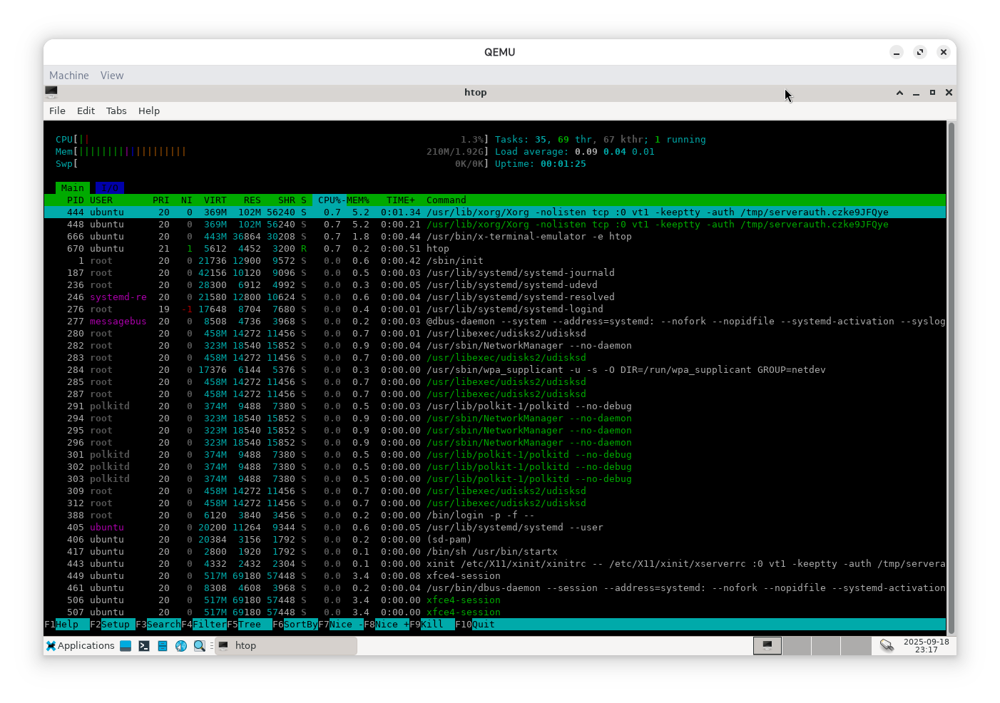

# minibuntu
 A set of Ubuntu spins with a mission for smallness.

Right now contains four spins:
- base (internal)
- rescue
- calatest (internal)
- carl (private, tailored to @carldev14)

# What is special about minibuntu
Compare minibuntu-rescue with SystemRescue:
- minibuntu-rescue-2025.09.10.18.22.23.iso: 688 MiB
- systemrescue-12.02-amd64.iso: 1125 MiB

As can be seen, minibuntu-rescue is only about half the size of
SystemRescue, while still having enough features to be usable.

minibuntu spins aim to reduce ISO size as much as possible while still
being feature-rich and broadly compatible with most PCs. This reduces
download time, great for people with low Internet bandwidth, with the
side effect of being less bloated than normal ISOs as well.

# Requirements
Building any minibuntu spin requires Ubuntu 24.04 amd64 or newer,
along with these packages:
- debootstrap
- systemd-container
- wget
- rsync
- squashfs-tools
- xorriso
- apt-cacher-ng

# How to build
1. Clone the project and `cd` to the project root
2. Create the base root first by running
`sudo ./buildroot-base.sh`
3. `cd` to the folder of any spin you want, like `rescue`
4. Run `sudo ./buildroot-<spinname>.sh` in the folder to build the root of
that spin
5. Once the root is built, run `../buildiso.sh` to build a ready to use ISO

# Screenshots

minibuntu-rescue running htop:

minibuntu-rescue running on real hardware, with almost all GUI apps showcased:
