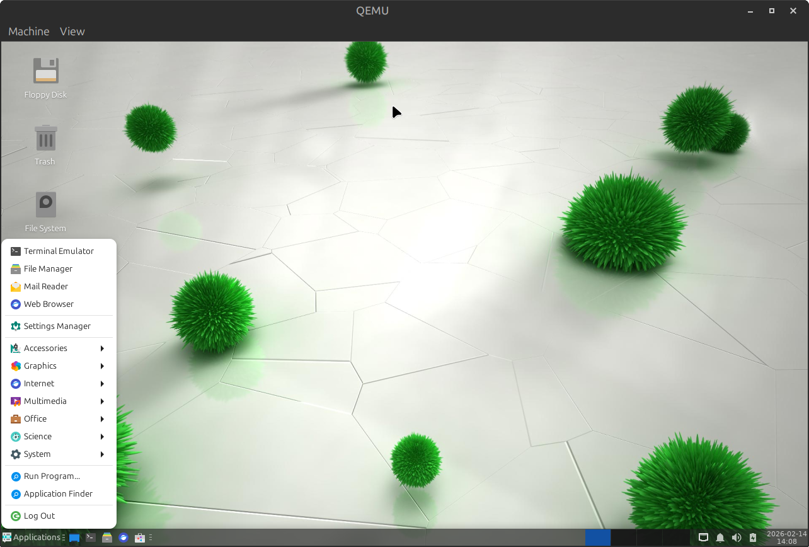
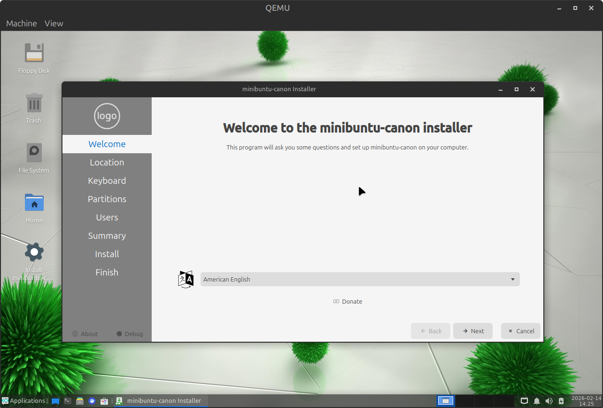
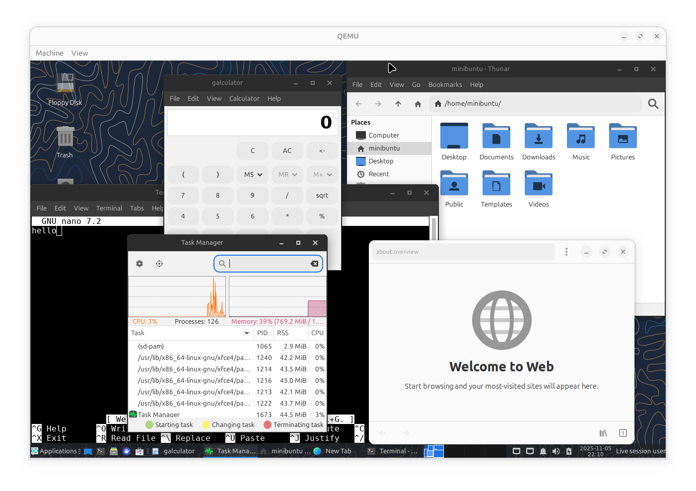
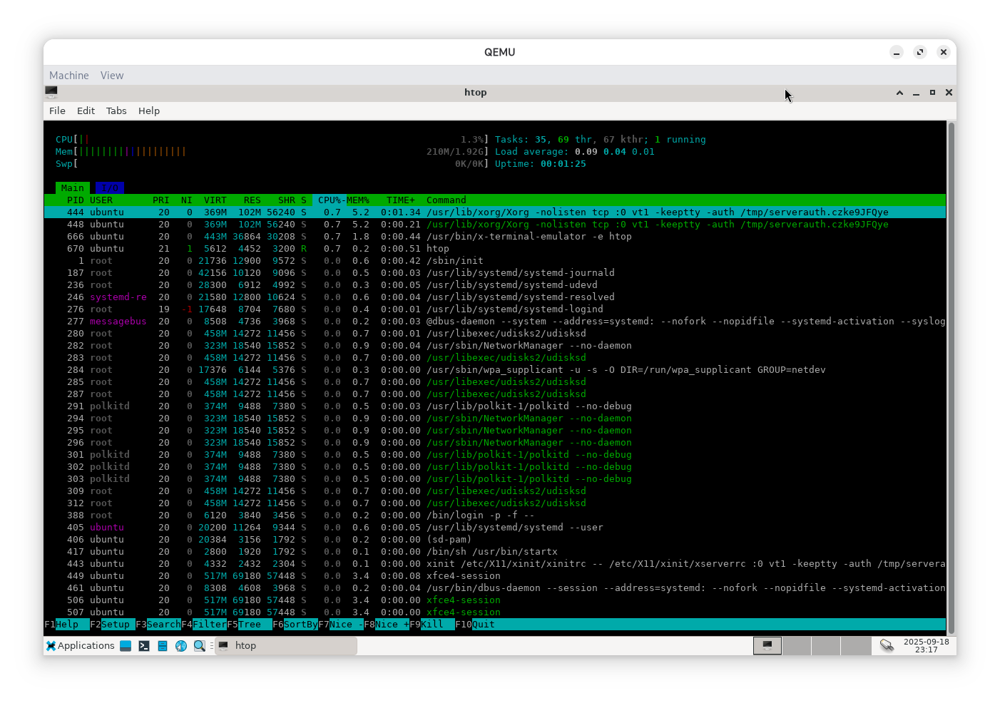
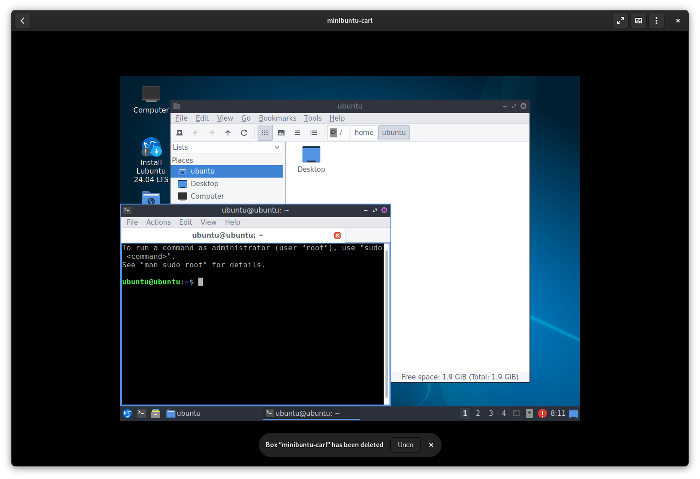

# minibuntu

A set of Ubuntu spins with a mission for smallness.

Right now contains five spins:

- base (internal)
- rescue
- calatest (internal)
- carl (private, tailored to @carldev14)
- canon (this is the canonical distro; can be referred simply as "minibuntu")

# What is special about minibuntu

Compare minibuntu-rescue with SystemRescue:

- minibuntu-rescue-2025.09.19.00.15.26.iso: 666 MiB
- systemrescue-12.02-amd64.iso: 1125 MiB

As can be seen, minibuntu-rescue is only about half the size of
SystemRescue, while still having enough features to be usable.

Even with minibuntu-canon, which is more than twice as heavy, compare with
Xubuntu's official ISO:

- minibuntu-canon-2025.12.18.00.07.39.iso: 1.44 GiB
- xubuntu-24.04.3-desktop-amd64.iso: ~4.0 GB

minibuntu spins aim to reduce ISO size as much as possible while still
being feature-rich and broadly compatible with most PCs. This reduces
download time, great for people with low Internet bandwidth, with the
side effect of being less bloated than normal ISOs as well.

# Requirements

Building any minibuntu spin now requires Ubuntu 24.04 amd64 or newer,
along with these packages:

- debootstrap
- systemd-container
- wget
- unzip
- rsync
- squashfs-tools
- xorriso
- apt-cacher-ng

This is optional but is used for testing:

- qemu-system-x86

# How to build

1. Clone the project and `cd` to the project root
2. Create the base root first by running
   `sudo ./buildroot-base.sh`
3. `cd` to the folder of any spin you want, like `rescue`
4. Run `sudo ./buildroot-<spinname>.sh` in the folder to build the root of
   that spin
5. Once the root is built, run `sudo ./buildiso.sh` to build a ready to use
   ISO

# Screenshots

minibuntu(-canon) on QEMU:

minibuntu's installer:

minibuntu on QEMU (early version):

minibuntu-rescue on QEMU running htop (very light!):

minibuntu-rescue running on real hardware (Surface Laptop 4), with almost all
GUI apps and Wi-Fi showcased:

minibuntu-carl on QEMU:

